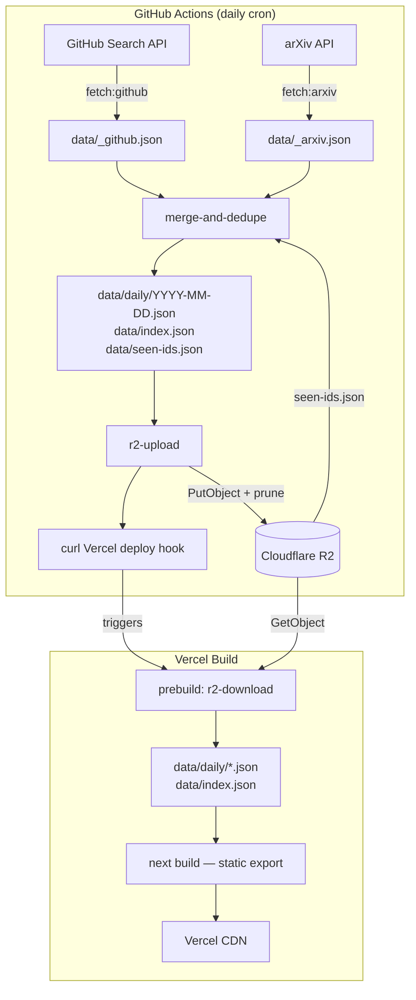

# ChipFeed Architecture

> Full pipeline overview, environment setup, and content configuration.

## Workflow Diagram



## Data Pipeline

| Script | npm command | Role |
|--------|------------|------|
| `fetch-github.ts` | `fetch:github` | Queries GitHub Search API for each keyword group; writes `data/_github.json` |
| `fetch-arxiv.ts` | `fetch:arxiv` | Queries arXiv API across configured categories and keywords; writes `data/_arxiv.json` |
| `merge-and-dedupe.ts` | `fetch:merge` | Merges both sources, filters cross-day duplicates via `seen-ids.json`, sorts, writes `data/daily/YYYY-MM-DD.json` and updates `data/index.json` |
| `backfill-seen-ids.ts` | `backfill:seen` | One-time script to seed `seen-ids.json` from existing daily files |
| `r2-upload.ts` | `upload:r2` | Uploads `index.json`, `seen-ids.json`, and all `daily/*.json` to R2; prunes objects older than `DATA_RETENTION_DAYS` |
| `r2-download.ts` | _(prebuild)_ | Downloads `index.json` + each daily file from R2 into `data/` before `next build` |
| `r2-download-index.ts` | `download:index` | Downloads `index.json` and `seen-ids.json` from R2 so `merge-and-dedupe` can use them |
| `r2-client.ts` | — | Shared S3-compatible client for Cloudflare R2 |
| `config.ts` | — | Keyword groups, arXiv categories, tunable constants |
| `types.ts` | — | Shared TypeScript interfaces (`GitHubItem`, `ArxivItem`, `DailyData`, `IndexManifest`, `SeenIdRegistry`) |

## Cross-Day Deduplication

Popular repos and papers often appear in multiple daily fetches. The `seen-ids.json` registry tracks every item ID and the dates it was seen, so the merge step can filter out items that already appeared on a previous day.

### Schema (`data/seen-ids.json`)

```typescript
interface SeenIdRegistry {
  ids: Record<string, string[]>;  // item ID → list of ISO date strings
  lastUpdated: string;
}
```

### How it works

1. `r2-download-index.ts` downloads `seen-ids.json` from R2 (gracefully handles missing file on first run)
2. `merge-and-dedupe.ts` loads the registry, keeps only items that are new or were only seen today, registers new IDs, and writes the updated registry back
3. `r2-upload.ts` uploads the updated `seen-ids.json` to R2

Items seen on a previous day are excluded from the daily file. Same-day re-runs are idempotent — running merge twice on the same day produces the same output.

### Backfilling

To seed the registry from existing daily files (e.g., after a fresh setup):

```bash
npm run backfill:seen
```

## Environment Variables

### GitHub Actions Secrets

| Secret | Required | Description |
|--------|----------|-------------|
| `GH_PAT` | Yes | GitHub Personal Access Token — used by `fetch-github.ts` for Search API |
| `R2_ENDPOINT` | Yes | Cloudflare R2 S3-compatible endpoint URL |
| `R2_ACCESS_KEY_ID` | Yes | R2 API token access key ID |
| `R2_SECRET_ACCESS_KEY` | Yes | R2 API token secret access key |
| `R2_BUCKET_NAME` | Yes | R2 bucket name |
| `VERCEL_DEPLOY_HOOK` | Yes | Vercel deploy hook URL — triggers a rebuild after upload |

### Vercel Environment Variables

The `prebuild` script (`r2-download.ts`) runs before `next build` on Vercel and needs R2 credentials:

| Variable | Description |
|----------|-------------|
| `R2_ENDPOINT` | Same R2 endpoint as above |
| `R2_ACCESS_KEY_ID` | Same R2 access key |
| `R2_SECRET_ACCESS_KEY` | Same R2 secret key |
| `R2_BUCKET_NAME` | Same R2 bucket name |

Set these in **Vercel → Project Settings → Environment Variables**.

## Content Configuration

All search keywords and constants live in `scripts/config.ts`.

### Keyword Groups (8 groups, shared across GitHub + arXiv)

| Group | Example keywords |
|-------|-----------------|
| `hardware-design` | FPGA, ASIC, RTL, Verilog, SystemVerilog, VHDL |
| `synthesis-pnr` | logic synthesis, place and route, EDA, OpenROAD, yosys |
| `accelerators` | AI accelerator, TPU, NPU, systolic array |
| `model-compression` | quantization, pruning, knowledge distillation |
| `optimization` | HLS, CUDA, kernel optimization, operator fusion |
| `frameworks` | TVM, MLIR, ONNX, TensorRT, OpenVINO, Triton |
| `edge-ai` | TinyML, embedded ML, on-device inference |
| `ai-hardware` | neuromorphic, in-memory computing, photonic computing |

### Tunable Constants

| Constant | Default | Description |
|----------|---------|-------------|
| `REQUEST_DELAY_MS` | `3500` | Delay between API requests (arXiv requires >3 s) |
| `GITHUB_MAX_PAGES` | `1` | Max pages to paginate per keyword group |
| `GITHUB_PER_PAGE` | `20` | Results per GitHub Search API page (max 100) |
| `ARXIV_MAX_RESULTS` | `100` | Max papers per arXiv query |
| `DATA_RETENTION_DAYS` | `365` | R2 objects older than this are pruned on upload |

## Local Development

### Full pipeline (mirrors CI)

Requires `.env` with R2 credentials and `GH_PAT`:

```bash
export GH_PAT=your_github_personal_access_token
npm run pipeline
```

This runs the complete flow: download index + `seen-ids.json` from R2 → fetch GitHub → fetch arXiv → merge with cross-day dedup → upload back to R2.

### Fetching data only (no R2)

```bash
export GH_PAT=your_github_personal_access_token
npm run fetch:all
```

This fetches and merges locally but skips the R2 round-trip. Dedup still works if `data/seen-ids.json` exists locally (e.g., from a previous `pipeline` run or `npm run backfill:seen`).

### Testing R2 locally

Create a `.env` file (git-ignored) with your R2 credentials:

```env
R2_ENDPOINT=https://<account-id>.r2.cloudflarestorage.com
R2_ACCESS_KEY_ID=...
R2_SECRET_ACCESS_KEY=...
R2_BUCKET_NAME=...
```

Then upload or download:

```bash
npm run upload:r2      # upload data/ to R2
npx tsx scripts/r2-download.ts   # download from R2 into data/
```
